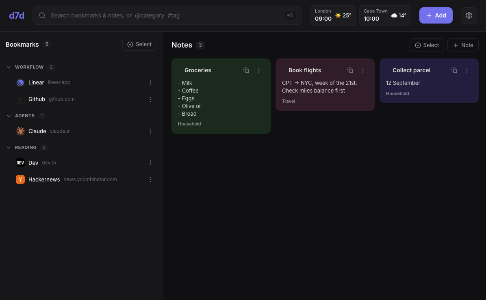

# d7d — dashboard

> A client-only personal dashboard **PWA** — bookmarks, notes, and a search-first
> command surface — with **no backend, no accounts, no tracking**. Everything lives
> in your browser; your data moves between devices via manual export / import.

**[▶ Live demo](https://d7d.pages.dev)** · light / dark · installable · works offline



Built with **React + Vite + TypeScript**, **Dexie** (IndexedDB), **Zustand**,
**@dnd-kit**, and **vite-plugin-pwa**. Styling is plain CSS with a design-token
system (light / dark / accent / density) — no UI kit, no CSS framework.

## Features

- **Bookmarks** — grouped, collapsible category list; tags; DuckDuckGo favicons (cached offline); drag-to-reorder.
- **Notes** — colour-coded sticky notes; pin; grid layout; quick colour swap; copy-to-clipboard.
- **Search** — `@category`, `#tag`, and free-text filtering across both panels, with quoted multi-word names, recent-search history, and autocomplete.
- **Bulk actions** — multi-select to set category / add tags / delete.
- **Category & tag management** — rename and delete (reassign items, or delete them too).
- **Clocks & weather** — multi-location, timezone-correct clocks + Open-Meteo weather (keyless, cache-first).
- **Own your data** — one-file JSON export; import with a diff preview (**Amend** or **Replace**).
- **Offline-first PWA** — installable; drag-reorder, undo-on-delete, keyboard-accessible throughout.

## Built spec-first

This wasn't vibe-coded — it went through a documented process, each stage reviewed
before the next (**ideate → functional → design → technical → implementation → launch**):

- [Functional spec](docs/functional-spec.md) — what it does and how it behaves
- [Design spec](docs/design-spec.md) — the token system and interaction model
- [Technical spec](docs/technical-spec.md) — architecture, data model, and the tricky bits (search grammar, import diff, favicon caching, offline)

## Develop

```bash
npm install
npm run dev        # http://localhost:5173
npm run build      # type-check + production build → dist/
npm run preview    # preview the production build locally
```

## Deploy (Cloudflare Pages)

```bash
npx wrangler login    # one-time: authorise your Cloudflare account
npm run deploy        # build + upload dist/ to Cloudflare Pages
```

The first deploy creates a Pages project named **`d7d`** (change `--project-name`
in `package.json` for a different name/subdomain). `public/_redirects` provides the
SPA fallback.

## Data & privacy

No servers, no analytics. The only outbound requests are **favicons** (DuckDuckGo,
toggleable) and **weather** (Open-Meteo, when you add locations) — both optional and
cache-first. Your bookmarks, notes, and settings never leave the device except in an
export file you create. On iOS, **Add to Home Screen** and export regularly — browser
storage is evictable (see Options → Data & Backup).

## License

[MIT](LICENSE)
